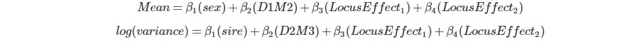
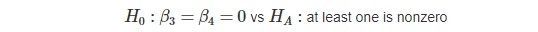
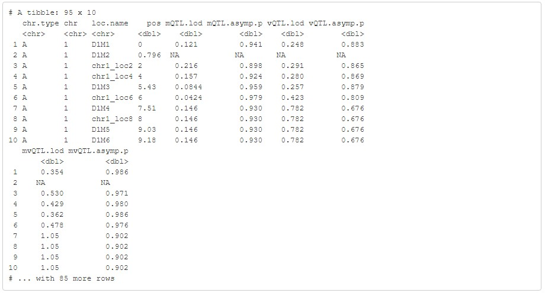

### Introduction  
Fundamental to our stress-splicing analysis is the `R` function
`scanonevar()` from the `vQTL` package. This function seeks to identify specific genetic loci that impact the phenotype *mean* and/or the phenotype *variance* by fitting and comparing two models for each measure: a "null model", consisting only of
nuisance factors, and an "alternative model", consisting of nuisance factors and locus effects. We will demonstrate its use with an example exercise in `R` provided by Robert Corty.  

### Understanding the Input

`library(qtl)`  
`library(vqtl)`

The `scanonevar()` function requires an object of type `cross`. Using
the code below, we simulate an object of this type with a function from the
`qtl` package.  
`set.seed(27599)`  
`test.cross <- qtl::sim.cross(map = qtl::sim.map(len = rep(20, 5), eq.spacing = FALSE))`  
The resulting object consists of two dataframes: `test.cross$geno`
and `test.cross$pheno` which contain genetic and phenotypic information
respectively.  

To provide a more complete demonstration of the function, we also include two additional variables in the `test.cross$pheno` dataframe:  
`test.cross[['pheno']][['sex']] <- sample(x = c(0, 1), size = qtl::nind(test.cross), replace = TRUE)`  
`test.cross[['pheno']][['sire']] <- factor(x = sample(x = 1:5, size = qtl::nind(test.cross), replace = TRUE))`  

These two variables, `sex` and `sire`, will be included in the models as "nuisance factors". Nuisance factors are variables whose effects we wish to
adjust for during analysis. Generally, they are either of immediate
interest to research or they are irrelevant, tertiary measures; their inclusion is optional.  

Next, we again rely on a `qtl` function to calculate the genotype
probabilities at each locus:  
`test.cross <- qtl::calc.genoprob(cross = test.cross, step = 2)`

Finally, we can call `scanonevar()`:  
`sov <- scanonevar(cross = test.cross, mean.formula = phenotype ~ sex + D1M2 + mean.QTL.add + mean.QTL.dom, var.formula = ~ sire + D2M3 + var.QTL.add + var.QTL.dom)`

Each argument supplied above is required by the function. It should
also be noted that a response variable from `test.cross$pheno` must be
provided for the `mean.formula` model.
To fully unpack the arguments, DXMX are marker names and are also nuisance factors along with
`sex` and `sire`, and each
"..QTL.." term represents locus effects. Thus, our models are as follows:

  

Now, recall that `scanonevar()` tests for a location effect by comparing
two models: a null model and an alternative model. In our example, this
comparison amounts to the following hypothesis test:

The output of the function is directly related to this hypothesis test.

### Interpreting the Output

The results of `scanonevar()` are reproduced below:  
  
The results for each test are contained in columns of the `sov$result`
output: `mQTL.lod` supplies the test statistic for the effect of each
locus on the phenotype mean, `mQTL.asymp.p` provides the associated
p-value, `vQTL.lod` gives the test statistic for the effect of each
locus on the phenotype variance, and so on. The p-value is directly related to the LOD and is determined
by `1-pchisq(LOD, df)` where df = (# of terms under alternative model)
- (# of terms under null model). In our example, df = 4-2 = 2.  

LOD values can be useful for comparing relative magnitude *within* tests, while p-values allow for meaningful comparisons *between* tests. A high LOD (and therefore a low p-value) indicates a significant effect.  

As we can see, all of the values displayed in the `...asymp.p` column for each test are above a significance threshold of 0.05. Therefore, we conclude that none of the listed loci have a significant effect on either the mean or the variance of our phenotype.
