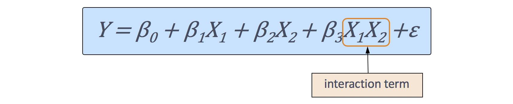

# vQTL Analysis and Scanonevar function
## Introduction
The goal of our analysis is to run [vQTL](https://www.g3journal.org/content/8/12/3757) using the `scanonevar()` function on the set of data of corn crops. This
function allows the user to identify genetic loci that affect a given phenotype mean and/or variance.

## `Scanonevar()` Function
The `scanonevar()` function was developed by Robert Corty and is an extension of the `scanone()` function from the [`qtl` package](https://www.g3journal.org/content/8/12/3767). This
function estimates the likelihood that any particular gene affects the mean and/or variance of a specified phenotype. The function provides the relevant test statistics and corresponding p-values of each respective gene. Genes with high log-odds ("LODs"), and consequently low p-values, are the genes that are most significant and most useful to the project. The `scanone()` function can easily be run on a local computer while the `scanonevar()` function can take hours to run. For a thorough demonstration of the use of this function, see our [introduction to `scanonevar()`](https://stapleton-lab.readthedocs.io/en/latest/Using%20Scanonevar/).

## Interactive model
Relevant to our research is the effect of the combination of certain environmental factors (*A, B*) with breed type (*hybrid, inbred*) on the stress gene levels of our samples. Therefore, an additive model is insufficient and we instead seek to implement the interactive model given below:  

  

## `Scanonevar.perm()` Function
This function runs numerous permutations of `scanonevar()` to identify the accuracy of the `scanonevar()` function. This function, however, takes a lot longer to run and is not doable on a home computer and requires a super computer. We send these to TACC which is the HPC in Texas.
## Effectsizes function
## Outputs
## Plots
